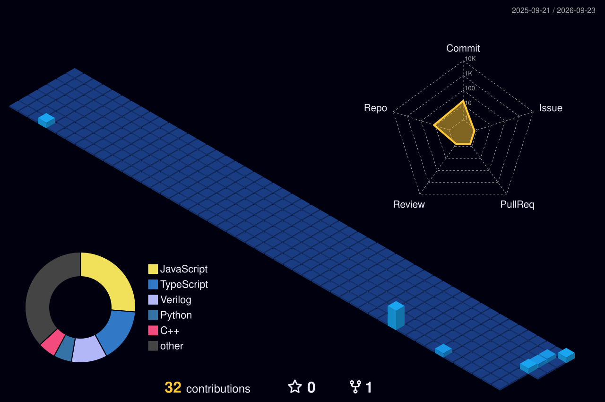

<div align="center">


<br>


<br><br>


<br><br>

<a href="https://github.com/NipunGoel12">

</a>

</div>

---

# 🧭 01 — WELCOME TO MY WORKSPACE

<div align="center">

```text
╔════════════════════════════════════════════════════════════════════╗
║                                                                    ║
║                    W E L C O M E                                   ║
║                                                                    ║
║                 to Nipun's GitHub Universe                         ║
║                                                                    ║
║          Software     AI     Robotics     Products                 ║
║                                                                    ║
║                    ↓                                               ║
║              BUILD SOMETHING                                      ║
║                                                                    ║
╚════════════════════════════════════════════════════════════════════╝
```

</div>

Hey! I'm **Nipun Goel**, a B.Tech Electronics & Communication Engineering student who enjoys turning ideas into technology.

I don't like learning technologies just for the sake of collecting them.

I prefer:

> **Learn → Build → Break → Understand → Improve → Ship**

My work moves between **software, hardware, robotics, AI and product development**.

---

# 🧬 02 — WHO AM I?

<table>
<tr>
<td width="50%">

## 👨‍💻 Developer

I enjoy building:

- Full-stack applications
- Interactive web platforms
- Backend systems
- Database-driven applications
- Automation
- AI-powered ideas

</td>
<td width="50%">

## 🤖 Engineer

I also enjoy:

- Embedded systems
- ESP32
- Robotics
- IoT
- Digital electronics
- RTL / Verilog

</td>
</tr>
<tr>
<td width="50%">

## 🚀 Builder

I like taking an idea from:

```text
IDEA
 ↓
DESIGN
 ↓
CODE
 ↓
TEST
 ↓
PRODUCT
```

</td>
<td width="50%">

## 💡 Explorer

Currently exploring:

```text
Software Engineering
Artificial Intelligence
Robotics
Product Development
Startups
```

</td>
</tr>
</table>

---

# ⚡ 03 — MY ENGINEERING UNIVERSE

<div align="center">


<br><br>


</div>

---

# 🧠 04 — HOW I THINK

<div align="center">

| 🔍 PROBLEM | 🧩 SYSTEM | ⚙️ BUILD |
|:---:|:---:|:---:|
| What needs solving? | How should it work? | Can I make it real? |

| 🧪 TEST | 🔧 IMPROVE | 🚀 SHIP |
|:---:|:---:|:---:|
| What breaks? | How can it improve? | Can someone use it? |

</div>

---

# 🌌 05 — PROJECT GALAXY

<div align="center">


</div>

---

## 🧠 HopeMove

### Digital Rehabilitation Platform

A technology platform designed around rehabilitation, guided recovery, AI-powered assistance and digital healthcare solutions.

**Technologies:** `React` `Node.js` `MongoDB` `Authentication` `Dashboards`

---

## 🌱 GrowZero

### Digital Growth Platform

A digital platform focused on helping businesses strengthen their online presence and customer engagement.

**Technologies:** `TypeScript` `Web Development` `Business Tools`

---

## 🤖 ESP32 RoboSoccer Bot

### Wireless Robotics System

A wireless RoboSoccer robot built around ESP32, FlySky controller and motor-driver based control logic.

```text
        🎮 CONTROLLER
              │
              ▼
            ESP32
              │
       ┌──────┴──────┐
       ▼             ▼
    MOTOR         MOTOR
       │             │
       └──────┬──────┘
              ▼
           ROBOT 🤖
```

**Technologies:** `C++` `ESP32` `FlySky` `Arduino` `Embedded Systems`

---

## ⚡ 16-bit ALU

### RTL Design & Verification

A 16-bit Arithmetic Logic Unit designed using Verilog HDL with a dedicated testbench and waveform verification.

```text
             INPUT
          ┌──────────┐
          │ 16-BIT   │
          │  A & B    │
          └────┬─────┘
               │
               ▼
        ┌──────────────┐
        │     ALU      │
        │ Arithmetic   │
        │ Logical      │
        └──────┬───────┘
               │
               ▼
            OUTPUT
```

**Technologies:** `Verilog HDL` `Icarus Verilog` `GTKWave` `RTL Design`

---

## 🏔️ Himalayan Grid

### Interactive Himalayan Exploration Platform

An interactive platform designed around exploring the Himalayan region through missions, quizzes and educational content.

**Technologies:** `JavaScript` `Interactive UI` `Educational Content`

---

## 💇 Salon-X

### Modern Business Website

A responsive website designed for salon services with service information, pricing and contact functionality.

**Technologies:** `HTML` `CSS` `JavaScript` `Bootstrap` `jQuery`

---

## 📇 ContactBook

### Desktop Contact Management System

A desktop application for managing contacts with complete CRUD operations and database integration.

```text
ADD → VIEW → SEARCH → UPDATE → DELETE
```

**Technologies:** `Python` `Tkinter` `SQLite` `OOP`

---

## 🏊 Bath & Swimming Pool Tiles Website

### Dynamic Business Platform

A Django-powered business website featuring product listings, enquiry functionality and backend data management.

**Technologies:** `Python` `Django` `Database` `HTML` `CSS`

---

# 🔬 06 — FROM SOFTWARE TO HARDWARE

<div align="center">

```text
                         ┌──────────────┐
                         │     IDEA     │
                         └──────┬───────┘
                                │
                ┌───────────────┼───────────────┐
                ▼               ▼               ▼
             SOFTWARE           AI            HARDWARE
                │               │               │
                ▼               ▼               ▼
             Backend        Intelligence      ESP32
                │               │               │
                └───────────────┼───────────────┘
                                │
                                ▼
                           REAL PRODUCT
```

</div>

I enjoy projects where different engineering domains meet.

**Frontend → Backend → Database → Hardware → Communication → Control**

---

# 🛠️ 07 — MY BUILDING PROCESS

<div align="center">

**STEP 01** 💡 FIND A PROBLEM  
↓  
**STEP 02** 🧠 UNDERSTAND THE SYSTEM  
↓  
**STEP 03** 🎨 DESIGN THE SOLUTION  
↓  
**STEP 04** 💻 BUILD  
↓  
**STEP 05** 🧪 TEST  
↓  
**STEP 06** 🔧 DEBUG  
↓  
**STEP 07** 🚀 SHIP

</div>

---

# 📊 08 — GITHUB CONTROL ROOM

<div align="center">


<br><br>


</div>

---

# 📈 09 — CODING ACTIVITY

<div align="center">


</div>

---

# 🌌 10 — MY CONTRIBUTION WORLD

<div align="center">



<br><br>

### Every square represents a small piece of the journey.

**One commit at a time.**

</div>

---

# 🐍 11 — THE CONTRIBUTION SNAKE

<div align="center">

<picture>
  <source media="(prefers-color-scheme: dark)" srcset="./output/github-snake-dark.svg">
  <source media="(prefers-color-scheme: light)" srcset="./output/github-snake.svg">
  
</picture>

<br><br>


</div>

---

# 🏆 12 — BEYOND CODE

<div align="center">

| 🎤 Public Speaking | 🌍 Model United Nations | 🚀 Startup Competitions | 🧩 Hackathons |
|:---:|:---:|:---:|:---:|
| 🤖 Robotics | 💡 Product Building | 🧠 Problem Solving | ⚙️ Engineering |

</div>

---

# 🎯 13 — WHAT'S NEXT?

<div align="center">

```text
              ┌──────────────────────┐
              │      CURRENTLY        │
              └──────────┬───────────┘
                         │
          ┌──────────────┼──────────────┐
          ▼              ▼              ▼
      SOFTWARE          AI           ROBOTICS
          │              │              │
          └──────────────┼──────────────┘
                         │
                         ▼
                 PRODUCT BUILDING
                         │
                         ▼
                    STARTUPS 🚀
```

</div>

I'm continuously working towards becoming someone who can go from:

**Problem → Architecture → Code → Hardware → Product**

---

# 💭 14 — ENGINEERING PHILOSOPHY

<div align="center">

### I don't want to just learn technology.

### I want to **build with it.**

<br>

**LEARN → BUILD → BREAK → DEBUG → UNDERSTAND → IMPROVE → SHIP**

<br>

### 🚀 BUILD THINGS THAT MATTER.

</div>

---

# 🌐 15 — LET'S CONNECT

<div align="center">

<a href="https://www.linkedin.com/in/nipun-goel-801a87373/">

</a>

<a href="mailto:nipungoeln12@gmail.com">

</a>

<a href="https://github.com/NipunGoel12">

</a>

<br><br>


</div>

---

<div align="center">

## ⭐ BUILD • LEARN • CREATE • REPEAT ⭐


</div>
